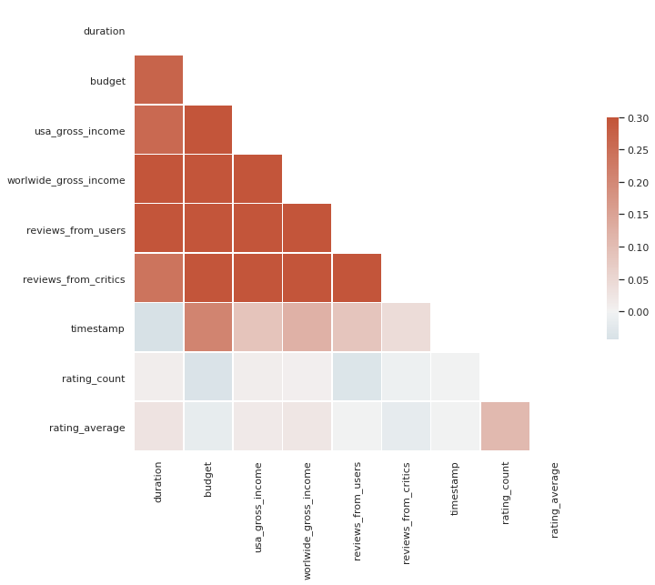
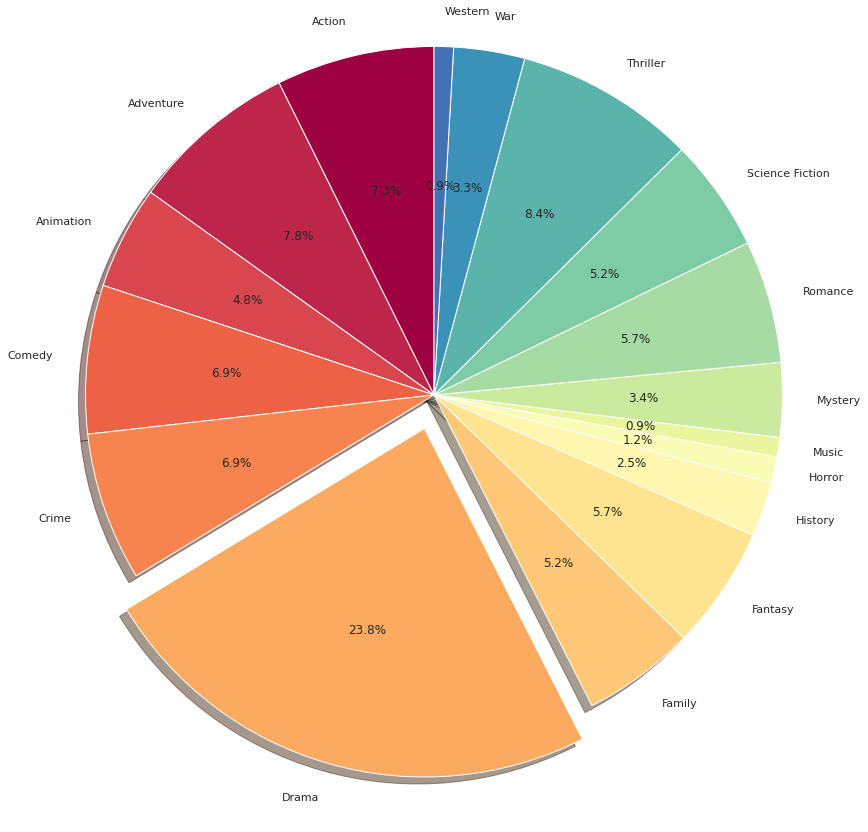

# Movie_Recommendor

* Developed a movie recommender system using IMDB database which used both collaborative filtering and content-based filtering methods in sklearn.
* Implemented singular value decomposition (SVD) to factorize the movie-rating matrix and used cosine similarities to define the similarities between users.
* Transformed the movie descriptions to features by TF-IDF and measured the cosine similarities between movies.

Everyone loves movies irrespective of age, gender, race, color, or geographical location. We all in a way that connected to each other via this amazing medium. Yet what most interesting is the fact that how unique our choices and combinations are in terms of movie preferences. Some people like genre-specific movies such as thriller, romance, or sci-fi, while others focus on leading actors and directors. 

In this project, We are interested in building a movie recommender system that uses several algorithms, including content-based algorithm, and collaborative filtering. Our recommender system is able to provide choices for people based on movies’ demographic features such as movie popularities, the genre of movies, the overview of the movie, and its crew and cast information to recommend a movie which is similar to the ones they like.

This is a word cloud of commonly seen words in description of top 500 films. 

This is the correlation plot for features in the cleaned dataframe. 

This pie chart showed the movie genres for top250 films.

If you're interested, please read the ipynb file. 
